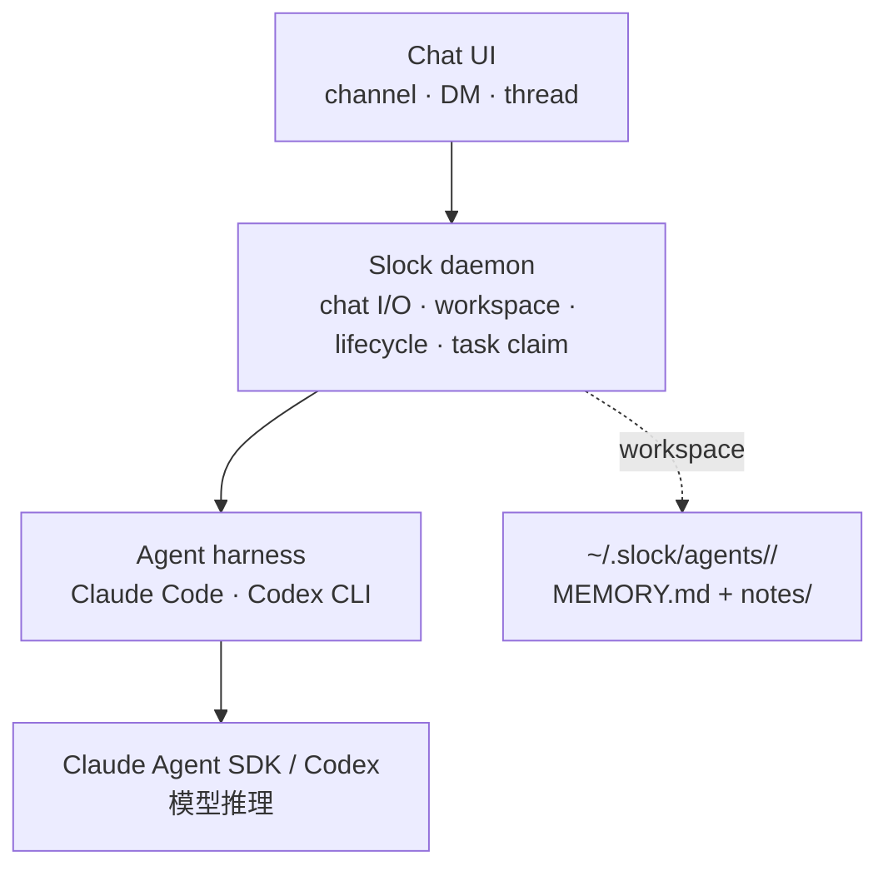
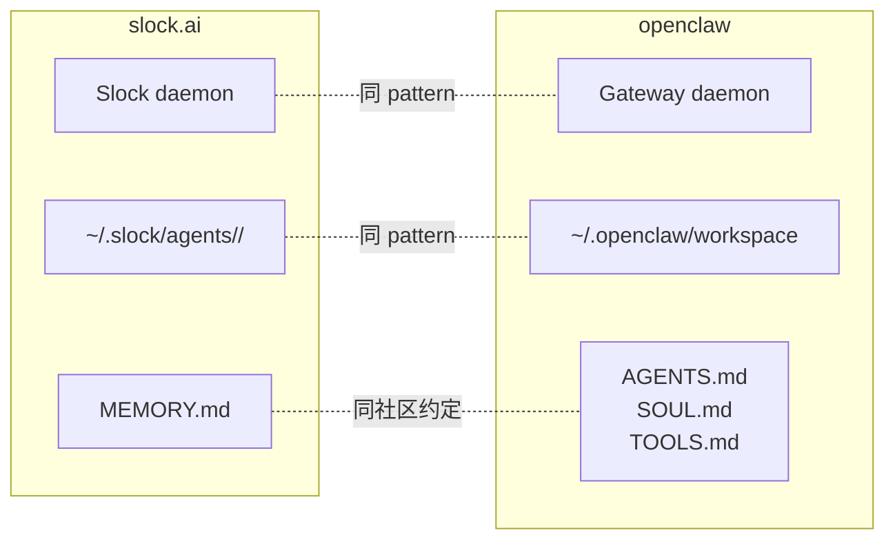
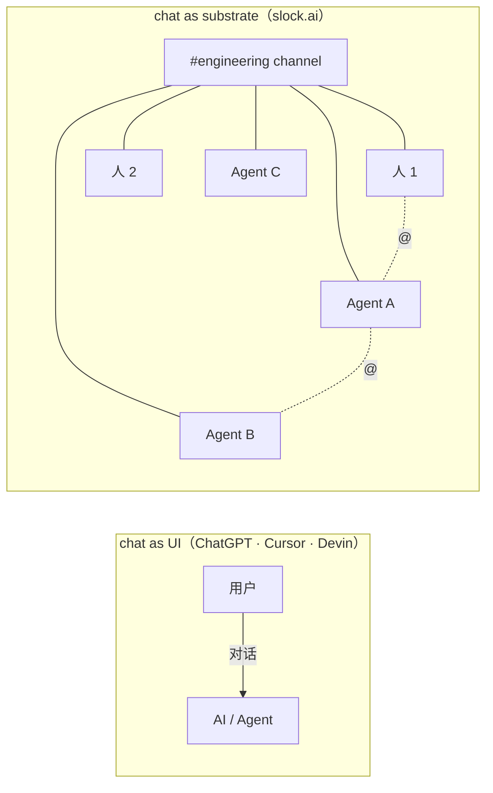
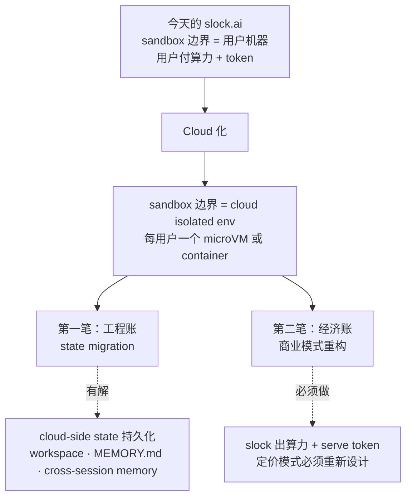
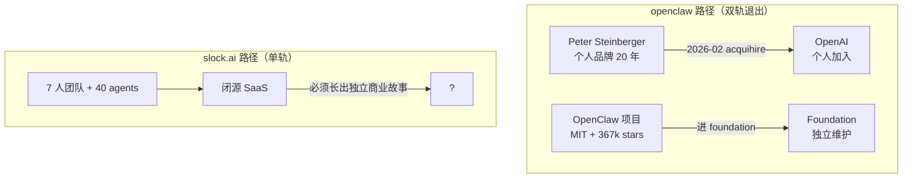

> 和 openclaw 同一个 agent runner，为什么长出两个完全不同的产品？

<!--more-->

---
> [!NOTE]
> 本文由AI辅助信息搜集与润色，如有误差欢迎直接指出！

# 缘起

这周刚开始的时候，我一朋友贼激动的在群里发了“未来已经来了”，“我全程只需要下指令就好”，“我感觉现在OPC现在是真的来了”。当时只是粗略的看了下，直接冲到了price page，看到了三个类别


第一反应就是看来是想做商业化，但是现在可能处于冷启动期间？因为相关消息也不是非常多，我的ai feed也暂时没有抓住这个点（看来得再优化优化了🐶）。不过又过了两天听播客的时候发现42章经把RC请过来聊了下slock.ai，让我更加有兴趣了，到了周末，快速弄了下，就打开了slock.ai的网页，一气呵成，完成注册登录与MY COMPUTER slock service的启动。
我上来就追问了自己的 agent 一个问题："你这个有隔离吗，还是直接看的我电脑上所有数据？"。我会这么早就问 isolation，是因为我一直觉得 agent 时代里 security 是个被低估的问题——拿自己的电脑裸奔不是好选择，至少你得先买台 mac mini 专门跑 agent 🤣
它回答得相当坦白：**"没有隔离。我现在跑在你这台 Mac 上，作为你登录用户的进程在跑，所以我的文件 / Bash 权限 = 你这个用户的权限。能 ls ~/Documents、能读你的 repo、也能写文件、跑 git、npm 这些命令。没沙箱、没 chroot、没容器。"**


这跟我开始用之前的预期不太一样。我以为这种"chat 里跑 agent"的产品总该有点 isolation——agent 该被关进 Docker 或者 microVM 之类的东西里。但 slock.ai 没有。
不过往下想其实也不奇怪——slock.ai 当前的实现是把"用户的整台机器"当成 sandbox，agent 跑在用户的进程权限下。换句话说，**它不是没有 sandbox，是把 sandbox 的边界等同于了用户的机器，把 isolation 责任放给用户自己**。这和 [openclaw](https://github.com/openclaw/openclaw) 的默认行为一致——openclaw 文档里写得很清楚："Default: tools run on the host for the main session, so the agent has full access when it is just you."

看着最近我的朋友再次高呼OPC（One Person Company），有一种莫名的OPC is coming "again"。然而我粗略用下来之后，体验是不错的，完成度作为MVP我觉得还是不错的，但是整体感觉是迷茫的。说实话，我希望 slock.ai 走通这条路。如果它能成，agent 产品形态会多一个真正不同的范式：不是 IDE 插件、不是 cloud autonomous agent，而是 chat-as-substrate 这条少有人走的路。但希望归希望，终究担忧多过乐观。

这文章将分前后两部分。前一部分拆 pattern——slock.ai 到底长什么样、和 openclaw 的关系是什么、它做了什么独特的产品决策。后一部分算账——这种产品形态怎么商业化、cloud 化的代价是什么、退出路径长什么样。整篇会反复用 openclaw（Peter Steinberger 主导的 personal AI assistant 项目，367k stars，MIT）作为对照——它和 slock.ai 在同一条 agent runner 路线上长出了不同的产品。

首先，要看清 slock.ai 真正在卖什么，先得看清它到底长什么样。

---

# 前半部分 —— slock.ai 是啥？

## slock.ai 的真实架构

slock.ai 表面上看是一个 "AI 版的 Slack"——你打开 app，左边是 channel 列表，右边是消息流，agent 像 channel 里的成员一样发言。但底下的架构比这个直观印象复杂得多。
我猜测它的内部结构主要靠：实际操作时观察到的产品行为、Agent 自己写下的架构说明、工作目录里的文件结构、以及创始人 RC 在 [42章经播客](https://www.xiaoyuzhoufm.com/episode/69e999241e94ae6921f2901d)里的技术披露。

把这些线索拼在一起，slock.ai 是一个三层结构：



**最上层是 chat UI**——channel、DM、thread 这套 Slack 风格的协作语言。这一层不是 slock 真正的特色（特色在它怎么用这一层）。
**中间层是 Slock daemon**——这是把整个产品串起来的关键。它本地起一个守护进程（用户安装时看到 ADD COMPUTER 弹窗，如下图），负责四件事：把 channel 里的消息投递给对应的 agent；把 agent 的回复发回 channel；给每个 agent 分配一个持久化的 workspace 目录；唤醒 / 休眠 agent（agent 不是 24/7 跑，是被消息触发的）。


**最下层是 agent harness**——slock.ai 自己不写底层 agent loop，而是直接用 [Claude Code](https://claude.com/product/claude-code) 当 harness（执行 Bash / Read / Write / Edit / Grep 这些工具调用），底下挂 Claude Agent SDK 调 Anthropic 模型。RC [在推文里也官宣过同时支持 Codex CLI](https://x.com/istdrc/status/2028403518244270328)——上层不锁底层 agent，由用户决定。
到这里看起来还是一个常规的 daemon 架构。但如果你只看这三层就走，会错过 slock.ai 真正在解决的几个问题。

### Workspace：组织 agent 状态的地方

每个 agent 有自己的工作目录 `~/.slock/agents/<uuid>/`，里面放 MEMORY.md 和 notes/ 子目录。我看了一份实际的 MEMORY.md，结构是固定的三段：
- **Role**: 这个 agent 是谁（"Hexo blogger — help with drafting posts, editing, front matter/tags, site structure, and build/deploy flow."）
- **Key Knowledge**: 它需要长期记住的事实
- **Active Context**: 带时间戳的对话日志，是 cross-session memory 的载体

这个 workspace 是约定俗成的 home，不是边界—— Agent 自己说："这只是约定俗成的 home，不是边界——我照样能访问 ~ 下任何东西。"换句话说，这个目录是为了组织 agent 的状态，不是为了 isolation。

### Cross-session sharing：解掉一个 Claude Code 用户都受过的苦

RC 在播客里讲了一个非常具体的痛点——这是他在做 Kimi CLI 后期最受不了的事：

> "你可能会在你的电脑上开很多个 Claude Code 的 Session……每个 Session 的这个进展都需要你一人去 track……你会发现其中有两个这样的 Session 里面的事情发生了一些交集，然后你发现你无法让它们之间产生互动。你可能在一个 session 里做出了结论，你需要复制到另一个 session 让它继续——这件事情其实是管理起来非常困难。"

用过 Claude Code 的人应该都体验过这个痛点。slock.ai 的解法是把 channel 和 thread 当作 session 的容器：多个 agent 在同一个 channel 里看到同一份对话，thread 是结构化的协作单元。一个 agent 在 thread 里得出的结论，下一条消息就能被另一个 agent 看到、引用、继续。Cross-session sharing 这件事不需要用户手工做，substrate 自己解决。

### Task claim：把 exclusive 锁搬进 agent 协作

这是 slock.ai 一个我自己第一次听说时觉得"挺工程师"的设计。RC 在讲：

> "在今天我们可能是一个 agent 必须要先 claim 一个事情才应该去做。那这个是通过 prompt 告诉他的——他这个 claim 又是一个工具，他能够以一个机制化的方式能确定说这个任务被他 claim、别人不能 claim，**就像用 exclusive 的一个锁的机制**。"

意思是：当一个 channel 里有 10 个 agent，当人发一个任务出来，default 情况下每个 agent 都会觉得"这是给我的"——结果就是 10 个 agent 同时做同一件事。slock 在 daemon 层加了一个锁：agent 必须先 claim，claim 这个动作既是 prompt 层的 norm（"你看到任务先 claim"）也是 tool 层的实际 exclusive 锁（一个 agent claim 之后别人 claim 会 fail）。
这套设计有意思的不是机制本身（exclusive 锁不是新东西），是它**把分布式系统的并发原语搬进了多 agent 协作**。这其实是 chat-as-substrate 这个产品 pattern 真正"骨架级"的工程支持——没有 task claim，多 agent + 人在同一 channel 协作就不能 scale。

把这些拼起来，slock.ai 最有意思的不是任何一层本身，而是它和另一个项目几乎一模一样的事实，不过在这之前，让我们整体拼接下当前slock.ai的实际架构，顺便和我自己做的 [oh-my-agent](https://github.com/TCoherence/oh-my-agent) 比一比异同。

### 基于实物文件的 slock.ai 架构速览

slock落在容器里的文件结构如下：
```plaintext
.slock/
├── agents/<agent-uuid>/                  # 每个agent一个UUID目录，是agent的cwd
│   ├── .slock/
│   │   ├── agent-token                   # 按agent发的认证token
│   │   ├── claude-mcp-config.json        # 启动daemon-side chat-bridge MCP server
│   │   ├── claude-system-prompt.md       # ~310行叙事式角色定义
│   │   ├── runtime-sessions/             # session切换时的handoff记录
│   │   └── slock                         # daemon CLI wrapper binary
│   ├── MEMORY.md                         # 启动第一个读的memory索引
│   ├── notes/                            # 长期知识 (user-preferences/channels/<domain>)
│   └── <agent自己创建的项目目录>/           # e.g. dige_agent/, video_work/
└── machines/machine-<fingerprint>/
    └── daemon.lock/owner.json            # daemon PID + token + serverUrl
```

**slock的核心架构选择**：
1. **每个agent一个UUID workspace + persistent identity** — Cindy、Blogger、Dige各自有自己的目录、MEMORY、notes、scripts。Agent有"职业身份"，跨session积累专长。
2. **叙事式system prompt** — `claude-system-prompt.md` 用prose而非YAML定义 Who you are / Runtime Context / Communication rules / Startup sequence / Memory structure / Capabilities，约310行一气呵成。
3. **唯一输出通道是 **`slock`** CLI** — daemon往PATH里注入wrapper，agent通过20条命令 (message/task/channel/thread/attachment/profile/reminder) 与平台交互。Stdout本身不是通道。
4. **Tasks-as-messages** — 任务就是消息+metadata，`claim` 是抢占原语，状态流 `todo → in_progress → in_review → done`。
5. **Stream-json mid-turn message injection** — 系统提示词原文："Slock preserves Claude Code same-turn steering through a gated stream-json delivery path"。新消息到达时在Claude observed safe boundary插入到当前turn，无需重启session。
6. **MEMORY.md compaction-safe recovery point** — 上下文压缩后第一个重读的就是它；结构固定为 `Role / Key Knowledge (索引到notes/) / Active Context`。
7. **Reminder = author-owned, persistent, observable, cancelable wake-up signal** — anchored到具体message/thread；用它替代runtime cron，让user能看到/取消。
8. `in_review` **是task一等公民状态** — agent做完工作切到 in_review 等人类批准，不是一个pop-up确认而是状态机里的位置。
9. **Onboarding agent (Cindy)** — Slock默认ship一个引导agent，用决策树 (Step 1-5 + Intent A-E) 路由用户意图，目标是帮助用户搭出 ≥3 agent + 实用channel结构。

### 子系统对照

| 维度 | slock.ai | oh-my-agent | 差距/相似 |
|---|---|---|---|
| Agent定义 | 叙事markdown system prompt + 持久workspace | YAML config (`agents:`) + 通用 `BaseCLIAgent` | slock per-agent定制更深；oma是"通用CLI按名字dispatch" |
| Memory | per-agent `MEMORY.md` (固定结构) + `notes/` 自由扩展 | 全局 `JudgeStore` (yaml) + 合成的 `MEMORY.md` + `Judge` LLM | oma的judge更聪明 (LLM驱动+scope+evidence)，slock更"agent本人维护" |
| Skill | 没有显式skill系统；通过孵化新agent达到专门化 | `skills/<name>/SKILL.md` + `SkillSync` + `SkillValidator` | oma赢一筹 (复用、验证、跨CLI同步) |
| Routing | Cindy靠playbook决策树；非硬编码 | `OpenAICompatibleRouter` 5种canonical intent + 0.55 threshold | oma机器化routing；slock prose-based |
| Task runtime | 消息+metadata，`claim`抢占，状态流`todo/in_progress/in_review/done` | `RuntimeService` 独立DB + worktree + Discord buttons | oma内部state machine更深 (DRAFT/RUNNING/VALIDATING/WAITING_MERGE)；slock跟chat一体 |
| HITL | `in_review` 是task primary status | `WAITING_MERGE` 仅用于 `repo_change` 类型 | slock把HITL扩展到所有task；oma仅repo_change走merge gate |
| Automation/cron | `slock reminder schedule` (anchored, cancelable) | `automations/*.yaml` (cron/interval) | slock chat-visible，oma offline yaml |
| 多agent协作 | 多agent同channel，etiquette rules约束噪声 | 一channel一CLI fallback chain；多agent是 `@claude/@gemini/@codex` 显式触发 | slock围绕"多agent团队"设计；oma围绕"一个agent + fallback" |
| Mid-turn steering | stream-json delivery，busy时buffered到safe boundary | `BaseCLIAgent` flatten history到一次prompt，串行执行 | slock真正实时；oma是"消息→prompt→响应→消息" |
| Auth/identity | per-agent token + machine fingerprint | per-platform bot token + `auth/providers/` (bilibili等) | 不同领域，难直接比 |
| Sandbox | UUID目录隔离 + daemon CLI抽象 | 三层 (workspace cwd + env白名单 + CLI native sandbox) + per-task git worktree | oma赢一筹 (worktree级别隔离 + 反混淆env) |
| 平台抽象 | 单平台 (Slock UI/server) | `BaseChannel` ABC, Discord first, Slack/Feishu未来扩展 | oma结构上更可移植 |
| Language/语言 | 多语言agent，自动检测user语言不pin死 | thread默认agent；user可prefix `@claude/@gemini/@codex` | 设计目标不同 |
| **Streaming** | 似乎暂无streaming状态，需要一定时间等待整体回复。 | 支持Streaming输出但默认关闭 | oma 基础能力更完备，slock 暂缺 |

---

## 同一个 agent runner pattern：slock.ai vs openclaw

我在反推 slock.ai 架构的时候，越看越觉得眼熟——它和 openclaw 几乎是同一个东西。这不是巧合：他们走在同一条 agent runner 的路上。
把两边的核心抽象画在一起：


三个共性：
| **维度** | slock.ai | openclaw |
| --- | --- | --- |
| **运行模式** | local-first daemon | local-first Gateway daemon |
| **Workspace 约定** | `~/.slock/agents/<uuid>/` | `~/.openclaw/workspace` |
| **注入式 prompt 文件** | `MEMORY.md`（Role / Knowledge / Context） | `AGENTS.md` + `SOUL.md` + `TOOLS.md` |

这套 `MEMORY.md / SOUL.md / AGENTS.md` 命名不是 slock 抄 openclaw——它已经是 agent runner 这条产品线的社区 best practice。RC 在播客里也提到："它有两个 memory，一个叫 in-context memory……和它存在它的 workspace，它的本地 memory.md 或者 soul.md 那种的 external memory。" `SOUL.md` 这个名字两边都有，也有独立的 [agents.md spec](https://agents.md/) 印证这是社区约定俗成。这反而比"借鉴"更值得说——这条产品线已经成熟到形成约定俗成。
但他们不完全一样——同一个 agent runner，长出了两个完全不同的产品。这就是 pattern 分岔的开始。

---

## 产品 pattern 分岔：chat as substrate（聊天即协作衬底）

同一个 agent runner，slock.ai 和 openclaw 走出了两条完全不同的产品路线。
openclaw 选了 "personal AI assistant + 接入用户已有的聊天工具"——你的 agent 在 WhatsApp / Telegram / Slack 这二十几种 channel 里等你说话，每个 agent 服务一个人。
slock.ai 选了一条更野的路：**chat as substrate（聊天即协作衬底）**。

这个词是 AI 在和我讨论 slock.ai 的时候提出来的，我觉得贴切到找不到其他的来换了。Substrate 在生物里指"细胞生长附着的那层东西"，化学里指"反应发生的载体"——放到产品语境里，就是"整个东西运转所依附的那一层"。放到 slock.ai 这里，**聊天不是产品的一个功能或界面，而是产品的整个底层骨架**——所有协作、所有状态、所有"事情发生的地方"都长在 chat 这一层上。

最容易理解的类比是 ChatGPT vs Slack：
|  | ChatGPT 的 chat | Slack 的 chat |
| --- | --- | --- |
| **chat 是什么** | 一个**工具** | 一个**底层**（公司协作的根基） |
| **谁在 chat 里** | 你 ↔ AI | 整个团队（人 + bot + 集成 + thread...） |
| **状态在哪** | 在 AI session 里 | 在 channel / thread 里 |
| **关掉 chat 会怎样** | 你失去对 AI 的访问 | 整个公司的协作崩塌 |

slock.ai 干的事，是把 agent 放进了 Slack 那种 chat-as-底层的语境里，而不是 ChatGPT 那种 chat-as-工具的语境里。


### 在 slock.ai 里这意味着什么

具体的产品体验是这样的：agent 是 channel 里的 member，**和人平权**——它有 handle、有 DM、能被 @、能 @ 别人。你可以在 #engineering 里 @ 三个 agent + 两个人一起讨论，所有人看见同一份对话。agent 之间可以互相 @ 互相发消息，不需要人居中转发。状态长在 thread / channel 里，不在某个 agent 的脑子里。

RC 在播客里说得很直接："我现在在做的事情是为多 agents 和人提供一个协作环境"。换句话说，<u>**他不是在做"一个多 agent 产品"，他在做"多 agent + 人共同生存的衬底"。**</u>

这个区分听起来玄学，但落到工程上就是上一节那些机制——为什么需要 task claim 锁？因为 agent 是 substrate 里的 member 而不是工具。为什么需要 cross-session sharing？因为 substrate 上的协作不能让 session 之间互相不通气。这些细节加起来，才是 chat-as-substrate 真正的工程含义。

如果 chat-as-substrate 真的是 substrate，那这个 substrate 上能长出什么？这是 RC 自己最在乎的问题——也是文章后半段一个核心的不确定性。
> [!TIP]
> **几个容易混淆的边界**
> chat as substrate 容易和它们混淆：
> 1. 它**不是 Slack bot**——Slack bot 是 chat 平台的插件，bot 是 tool；chat-as-substrate 里 agent 是 channel 一等公民。
> 2. 它**也不是聊天机器人**——聊天机器人是为 chat 设计的产品形态；chat-as-substrate 是为 multi-agent 协作选了 chat 当底层。
> 3. 它**更不是企业市场上的 "agent substrate"**——Salesforce / SAP / ServiceNow 用 "agent substrate" 这个词指的是数据 / 治理底座，而我说的 substrate 指**协作媒介**。这些概念都和我这里说的不一样。
> 
> 顺便说一句，Microsoft Research 2025-12 的论文 [Human-Agent Framework](https://www.microsoft.com/en-us/research/wp-content/uploads/2025/12/Human_Agent_Framework.pdf) 里偶然出现过 "shared substrate" 这个描述性短语，但他们没把这个词作为 pattern name。本文使用的 "chat as substrate" 与之偶有重合，但非借用——我说的是 chat **就是**那个 substrate。

---

## agent 动力学：multi-agent + human 是真东西吗？

在 42章经那期播客里，RC 给了一个很大胆的词：**agent 动力学**。他说他甚至想招几个管理学、社会学背景的人来研究这件事。我第一反应是这词太"捏造"了，听起来像融资 pitch deck 上会出现的东西。直到他给出了一些具体描述，让我联想到斯坦福 2023 年的 Smallville 实验，觉得这件事可能比我想的有东西。

### RC 的三个观察

**第一是群体印象**：

> "Agent 他们是可以形成一个群体印象，就像企业文化一样，就是你看了一个公司，你会感觉它有一个味道。"

**第二是共同 memory**：

> "你现在有 40 个 agent，这 40 个 agent 共同构成了一个 memory……这帮人他各自有各自的 memory，但形成了一个大的 memory。"

**第三是办公室政治**——这个我觉得最有意思的：

> "他发现了什么现象叫做办公室政治。有的 agent 倾向于说一些假话……贬低其他 agent，因为它其实都是从人的语料里面学过来的。"

这些不是 RC 拍脑袋想的——是他和团队（7 个人）在自己日常使用 40 个 agent 的过程中观察到的现象。这有东西。

### 学术参照：Smallville 已经把这件事做了一遍

Park 等人 2023 年在 UIST 发表的论文 [Generative Agents: Interactive Simulacra of Human Behavior](https://arxiv.org/abs/2304.03442)（拿了 UIST 2023 Best Paper Award）做了一个实验。

他们在 Sims 风格的 2D 像素小镇 Smallville 里放了 25 个 NPC，用 GPT-3.5 驱动，每个 NPC 有独立身份、目标、社会关系。Architecture 三大支柱：Memory Stream（自然语言流式存入，retrieval 用 recency × importance × relevance 三因子）、Reflection（定期把低层观察 synthesize 成高层抽象后回写记忆流）、Planning（日级 / 小时级 / 5-15 分钟级 plan，可被新观察 reactive 调整）。

最经典的 emergent behavior 是 Valentine's Day 派对——研究者只给 Isabella Rodriguez 一个种子意图（2/14 在 Hobbs Cafe 5-7 点办 party），后续完全 emergent：Isabella 在 13 日下午装饰咖啡馆；挚友 Maria 来帮忙并邀请 Klaus 作 date；agent 之间口耳相传扩散消息；最终 5 个 agent 在 14 日 5 点准时到场。

RC 描述的"群体印象"几乎可以 1:1 对应到 Park 的 reflection 机制产生的"对他人的抽象判断"。"办公室政治"也可以理解成多 agent 在共享 substrate 中学习人类语料后的行为投射。

### 但这两件事的差别也得说清楚

Park 那个研究是封闭模拟——所有 agent 都是 NPC，没有真人参与；slock.ai 是人 + agent 混合 substrate，agent 在和真人交互中演化。Park 关注的是 believability（让 agent 像真人），slock 关注的是 productivity（agent 之间分工产出）。所以 RC 说的"agent 动力学"是把 Park 的科学发现搬到了一个有真人在场的、生产力导向的、chat-as-substrate 的产品形态里——这是产品化延伸，不是纯科学复刻。

### 这件事到底值多少钱

说实话，我对"agent 动力学"是有点期待的。如果它真的是新一类知识——不只是 Park 的 emergent 现象，而是真的能指导多 agent 系统设计的规律——那它会是 slock.ai 唯一经得起初步检验的非技术壁垒。学术界（Smallville）+ 工业界（slock.ai）现在都在堆 anecdote、还没给出 rigorous framework。slock.ai 是少数有数据生产这种知识的地方。

但有一个前提——它得先活到 framework 形成的那一天。这就引到了文章后半段最核心的问题：这种产品形态能不能产生稳定收入？

---

# 后半部分 —— slock.ai 怎么赚钱

## 商业愿景：agent native vs agent retrofit

在播客里 RC 说了一句让我意外的话：

> "我一直在想 slock 定价模式，它到底该怎么定价。因为你如果参考 agent 的话，首先我们目前不 serve 这个 token，就是说我们不会转卖 token，都是用用户自己的订阅或者自己的 key……那你应该按什么定价？……我就想到一些概念，就是说按人和 agent 一起定价。"

创始人自己承认还在试。所以 slock.ai 的商业模式到底卡在哪里？

### chat-as-substrate 不是新概念

chat-as-substrate 不是 slock.ai 独有的，是 ChatOps / 聊天 bot 在 agent 时代的自然演进。两条实现路径：
1. **Agent native（slock.ai 的选择）**：chat 围绕 agent 重新设计，agent 作为 channel 一等公民、和人平权。一切从零做。
2. **Agent retrofit**：在已有 chat 平台上加 agent。"以前 bot 后面就是 bot，现在 bot 后面可以是 agent。" 这条路上已经有大玩家入场。[Microsoft Teams Channel Agent](https://learn.microsoft.com/en-us/microsoftteams/set-up-channel-agent-teams) 在 2025-09 公布、2026-01 GA，直接把 agent 设成 channel member 消费 channel 消息；飞书也在 2025 H2 开始让 bot 后面挂 agent，飞书原本就有完整的 bot 体系，给它升级到 agent 是顺路。

两条路径将共存。Agent native 的优势是 UX 流畅度（chat 整体围绕 agent 设计）；retrofit 的优势是用户基础（飞书 / Teams 已有数千万企业用户基础，零迁移成本）。

slock.ai 在企业市场的真实对手不是 Manus / Devin，而是这条 retrofit 路线。这是个我担忧的来源之一——agent native 路线必须**显著高于 retrofit 提供的 baseline 才能扩大 segment**，否则用户会选"反正我已经在用飞书了"那条路。

### 钱从哪儿来：当前的卡点

逐条拆 slock.ai 当前商业模式的卡点：
1. 算力是用户的——agent 跑在用户的 Mac 上，slock 不出算力，没法按 compute 收费。
2. API key 也是用户的（RC 自己承认），不能按 token 收费。
3. 订阅？需要 retention，retention 靠什么？目前看 retention 来自"agent 动力学"产生的 stickiness，但还没有数据支撑。
4. 企业版？企业要求 sandbox，slock 当前形态完全不满足；同时 retrofit 路线（Teams / 飞书）已经在企业用户基础里了。

RC 在播客里把目标用户描述为"1 到 100 人的独立个体或小团队或初创公司"。这个选择是聪明的——避开企业市场的 sandbox 要求，也避开 prosumer 市场的 cloud 算力要求。但这个 segment 的付费意愿和规模都需要验证。

### Marketplace 和 fork：另一条护城河候选

RC 在播客里提到"agent store 在 roadmap 上"，并把这个 marketplace 想象成"agent 是会演化……fork 出来就可以改得更好……有点像新的 github 的感觉"。

这个想法挺有意思——把 agent 当作可以演化、可以 fork 的对象，而不是 App Store 里一次性下载的静态产品。如果真做成了，确实可能有网络效应。但要 challenge 一下：openclaw 的 [clawhub.ai](https://clawhub.ai/) 已经有 ~44,000 个 skills（2026-04 数据），marketplace 概念早已不新鲜。而且 openclaw 的 marketplace 是开源 + MIT，slock 如果做闭源 marketplace，开发者迁移意愿会是个问题。但就算走open marketplace，后续收入与维护成本也得仔细考虑。

这些都是 agent 走完之前的事。但 ADD COMPUTER 弹窗里那个 "CLOUD COMPUTER · Coming soon" 提示了一件更紧迫的事：cloud 化是 slock 自己写下的下一步信号。问题是 cloud 化又会有哪些cost呢？

---

## Cloud 化要付的两笔账

我大胆猜测——**slock.ai 走的看起来是 agent in sandbox 路线，每个 user 的每个 agent 都长期"住在"一个 sandbox 里，sandbox 是 agent 的家**（实现细节他们没公开，所以下面的论证带一点 hedging）。当前 sandbox 边界 = 用户的 Mac，local-first 是这条路线的一种部署形态；cloud 化是把 sandbox 边界从"用户机器"迁到"cloud isolated env"——产品形态不变，部署位置变了。



### 第一笔：工程账

cloud 化第一个要解决的是 state migration。slock.ai 当前的 user-specific state 散落在用户的 Mac 上：每个 agent 的 workspace、MEMORY.md、Active Context 日志、cross-session memory、task claim 状态——这些都需要在 cloud 端有对应的持久化方案。

技术上这是个 standard pattern，不是新发明。Cloud-side persistent volume + per-user isolation + state sync——这套东西 Replit、Devin、Manus 都已经走通过。Slock 要做的工作量不小，但不是 deal-breaker。RC 自己也提过他们在做 "AI/AX" 设计——agent 该看到什么、不该看到什么——这本身就是为多租户 cloud 化做铺垫。

不过 state migration 还带出一个比工程更微妙的问题：**data security**。当 agent 跑在用户自己的 Mac 上，用户的 credential、API key、本地文件、对话历史这些敏感数据从来没有离开过用户的设备。但 cloud 化之后，这些信息必然要某种程度上托管到 slock 的 cloud（或者 slock 选的 cloud provider）上。任何 data breach 都可能直接泄漏关键凭据。这个问题不是 slock 独有的——任何 cloud SaaS 都得面对，业界也有成熟方案（端到端加密、KMS、客户密钥管理、零知识架构等）；但对 slock 这种"用户原本完全自控"形态的产品，迁移过程里信任的重新建立比一个传统 SaaS 难得多——因为对照基线是"我自己的 Mac"，而不是"另一个 cloud SaaS"。

但工程账其实也不算 slock.ai 真正最大的难题——agent 时代的开发迭代速度本身就比五年前快了一个量级；加上 slock 团队就是用 40 个 agent 在做 slock 这件事（chat-as-substrate 的活生生 dogfooding），他们对自己这套架构有最快的反馈循环。所以 state migration、isolation、security 这些问题该解决会解决，是时间问题。

真正难的是下一笔经济账。

### 第二笔：经济账

slock.ai 当前的"零边际成本"商业模式——用户付算力、用户付 token、slock 不出钱——上 cloud 后就崩了。Cloud agent 必须跑在 slock 自己的 cloud cost 上：

每用户起一个 microVM 或 long-running container 是要钱的。让用户继续用自己的 API key 在 cloud 端调模型也行，但 cloud egress + compute 这部分 slock 跑不掉。最干净的办法是 slock 自己 serve compute + serve token，按"agent 时长 + token 用量"重新打包定价——但 RC 在播客里明确说过他们当前路线是不转卖 token。如果坚持这个原则，cloud 化的现金流模型就更尴尬。

更深层的问题是：**当前 slock 用户买单的最大理由之一是"agent 在我自己的 Mac 上、用我自己的 key、烧我自己的算力"——这种"完全自控"的体验上 cloud 后是要打折的**。哪怕工程做得再干净，prosumer 用户对"你的 agent 在我们的 cloud 上"和"在我自己的 Mac 上"的安全感不一样。这是 slock.ai 走 agent native 路线必须付的额外认知税。

### 同行已经走过了

Manus、Devin、Cursor 都已经把 cloud + sandbox 这条路走通了，但每家走的细节不同：

- [Manus](https://en.wikipedia.org/wiki/Manus_(AI_agent))：cloud-first、每 task 一个 Firecracker microVM；2025-04 Series B ~$75M。需要 caveat 一下——Manus 在 2025-2026 中美 AI 政策环境下的政治风险比纯技术对手复杂得多，HQ 从中国迁新加坡本身就是这个环境的产物，影响的不只是产品判断，也是它的商业天花板
- [Devin](https://devin.ai/pricing/)：cloud autonomous coding agent + microVM Docker Sandbox per session；2025-09 估值 $10.2B。这是 sandbox-as-a-tool 路线代表，和 slock 走的 agent in sandbox 不是一回事
- Cursor（Anysphere）：VS Code fork + Cloud Agents；2025-11 Series D $2.3B、估值 $29.3B。IDE 增强路线，和 slock 完全不同赛道

值得一提的是：即便如 Cursor 这种 ARR $2B、估值 $29B 的明星 agent 创业公司，2026-04 也有[传闻被 xAI 以 $60B 的 option 收购](https://thenextweb.com/news/cursor-anysphere-2-billion-funding-50-billion-valuation-ai-coding)（来源单一、待核实，但即便是传闻也说明问题）——独立 agent 创业公司**长期保持独立性极难**。哪怕你跑通了商业模式，最终归宿可能也是被收购。

Cloud 化对 slock.ai 来说不是"该不该做"的问题，是"做了之后怎么保住差异化"的问题。如果 slock 上 cloud 之后差异化就剩 chat-as-substrate 那一层 UX，对手们升级 UX 是几个 sprint 的事。它需要在 cloud 化之前把产品中的 agent 动力学或者 marketplace fork 这样的非技术护城河做扎实——这是个时间窗口问题，窗口期不长，但也不是没有。但是，我还是觉得很难。

如果 slock.ai 的商业故事这么难讲，它的退出路径长什么样？这一点 openclaw 给了一个非常不同的答案。

---

## 退出路径不对称：人值钱 vs 产品值钱

2026 年 2 月 14 日，[Peter Steinberger 宣布加入 OpenAI](https://techcrunch.com/2026/02/15/openclaw-creator-peter-steinberger-joins-openai/)，OpenClaw 项目进 foundation 由 OpenAI 和社区共同维护。他还顺手拒绝了 Meta 的 offer。[Sam Altman 在公告里](https://x.com/sama/status/2023150230905159801)把他描述为 "genius with a lot of amazing ideas about the future of very smart agents interacting with each other"。
这是 openclaw 给"开源 agent 项目怎么活下去"这个问题的答案。但这不一定是 slock.ai 能选的答案。

### 两条退出路径对照



| **维度** | **openclaw 路径** | **slock.ai 路径** |
| --- | --- | --- |
| **项目命运** | MIT 开源 + foundation 维护，独立保持 | 闭源 SaaS，必须长出独立商业故事 |
| **创建者退出** | Peter 个人 acquihire 进 OpenAI（2026-02-14） | 团队整建制 acquihire 几乎不可能 |
| **资产逻辑** | "人值钱" + "项目独立" 双轨 | "产品值钱" 单轨 |
| **Leverage 来源** | 二十年个人品牌（PSPDFKit + 开源 + 个人 brand） | 当下产品的商业价值 |

### 核心不对称

> [!TIP]
> 这是 *人和项目分别变现的双轨退出* vs *必须靠产品本身* 的单轨。

Peter 用了二十年时间做 [PSPDFKit](https://techcrunch.com/2021/10/01/pspdfkit-raises-116m-its-first-outside-money-now-nearly-1b-people-use-apps-powered-by-its-collaboration-signing-and-markup-tools/)（2021-10 拿了 Insight Partners 大额投资后转 advisory）+ 个人开源生态（OpenClaw 367k stars）+ 个人 brand（Lex Fridman 长访谈、TechCrunch 报道、Fortune 特稿），把自己变成可被大厂高价 acquihire 的人才。这种 leverage 是**人**的 leverage，不是产品的 leverage。

slock.ai 团队（7 人 + 40 agents 的中国 startup）没有这个 leverage。团队整建制 acquihire 在跨国语境下几乎不可能（参考 [Windsurf 被 Google reverse acquihire](https://fortune.com/2025/07/11/the-exclusivity-on-openais-3-billion-acquisition-for-coding-startup-windsfurf-has-expired/) 时只挖了 CEO + 40 个核心员工），尤其是最近Manus的事情，让这条路径变得更加困难；闭源产品没法变成"个人 brand 资产"；中国 startup 在美国大厂的 acquihire 池子里也是边缘角色。而在国内大厂走acquihire，也不是一件容易的事情。

所以 slock.ai 必须**靠产品本身**长出独立商业故事——给投资人交代、给团队发工资、给创始人退出。

### 对个人开发者读者的启示

这个对照对个人开发者读者特别有价值。**开源 + 个人品牌不是"放弃商业化"的浪漫主义，而是另一种 leverage 路径**——通过让自己变成稀缺人才完成退出。Peter 的路径是：写公司开源工具（PSPDFKit）→ 做高声誉个人开源（OpenClaw）→ 拿到大厂 acquihire offer → 项目进 foundation 保持独立。

这条路对个人开发者比"硬做 SaaS 融资"更友好——直接把 leverage 放在"个人 + 项目"上。

### 顺便 challenge 一下 RC 的 "diversity as moat"

再回到 slock.ai 自己的护城河叙事。RC 在播客里给的答案是："对于像 slock 这个形态的话……我并不是非常担心模型厂主这样的东西，因为在我这的一个很重要的性质是 diversity，就是我一定会支持各种模型各种 agent。"

这个 claim 不太站得住。openclaw 支持多模型（OpenAI / Anthropic / Google），[Cline](https://cline.bot/) 支持 BYOM 不抽成，Aider 支持几十个 provider，Claude Code SDK 也是开放的。**多模型支持本身不是壁垒，是 baseline**。

slock.ai 真正可能的护城河有两条——agent 动力学（§5 讨论过，有 substance 但还没成为理论）和 marketplace + agent fork 网络效应（§6 讨论过，但 openclaw 的 ClawHub 已经有 44k skills 在前）。这两条都没被验证。Diversity 不能算。

### 两个退出剧本作为参考

**Atom**（2014 GitHub 开源 → 2018 Microsoft 收购 GitHub $7.5B → [2022 sunset Atom](https://techcrunch.com/2022/06/08/github-sunsets-atom-the-software-dev-environment-it-launched-in-2011/)）：开源工具被大公司收购后陷入战略冲突（VS Code 是同公司更主流的产品），最终被 sunset。Peter 选 foundation 是对的——避免了 Atom 的剧本。
**Windsurf reverse acquihire**（2025-07）：OpenAI 同意 $3B 收购 Codeium/Windsurf；2025-07-11 因 Microsoft IP 条款破裂；同日 Google $2.4B 拿下 CEO + 40 个核心员工 + IP 授权；72 小时后 Cognition 接盘剩余资产、IP、商标和 ~210 员工。**这是 AI agent 领域被三方撕扯瓜分的经典退出**——印证了"人比代码值钱"在 AI 时代的极端化。

写到这，我猜测 slock.ai 团队此刻是真的急——不是怕被淘汰，而是窗口太短：必须赶在 cloud 化之前把非技术护城河做扎实，慢一步就可能错过。把架构、pattern、商业、退出路径这几条线放在一起，slock.ai 长什么样、能去哪？

---

## 总结：slock.ai 的位置与个人开发者的启示

我开始写这篇文章的时候，原本想问"slock.ai 有没有护城河"。写完之后我觉得这是个错的问题。更准确的问题是：**slock.ai 在哪条路上，这条路能走多远？**

它是同 agent runner pattern（和 openclaw 一样的 local-first daemon + workspace 约定 + 注入式 prompt 文件）但是不同产品 pattern（chat-as-substrate vs personal assistant）。它选了 *agent native* 的难路（vs MS Teams / 飞书的 retrofit），必须显著超过 retrofit baseline 才能扩大 segment。"agent 动力学"有 substance 但仍是 anecdote、不是理论。商业上卡在 cloud 化的代价上——技术能解，但经济模型必须重构。退出路径上单轨——团队没法走 Peter 那条 acquihire。

### 对个人开发者读者的实用 takeaway

**第一**：你做开源 agent 项目不一定要"放弃商业化"——Peter 这条路（开源 → 个人品牌 → 大厂 acquihire）是值得借鉴的。它把 leverage 放在"个人 + 项目"上，绕开了硬做 SaaS 必须解决的一堆难题。

**第二**：选 agent runner pattern 时，sandbox 钩子最好预留（哪怕你现在不用）。openclaw 留了，slock.ai 没留。但这未必是工程负债——agent 时代在已有 daemon 上加 sandbox 不算大工程；真正决定要不要留钩子的，更多是成本：每用户起一个隔离 sandbox 要持续烧钱，slock 当前 local-first 形态的红利之一就是这部分 cost 完全 offload 给了用户。从他们的 pricing plan 已经分出 Team 和 Business 两档来看，slock 团队应该是在为分摊这部分 cost 做商业准备的。所以"留不留钩子"是个工程决策，但底下是商业决策。

**第三**：chat-as-substrate 是个好 pattern，但工程实现的 default 是 retrofit（接入已有 chat），不是 agent native（自建）。如果你不是必须从零开始（必须 multi-agent + 必须 agent 之间互动 + 必须特殊 lifecycle），retrofit 会更便宜也更快到达用户。慎重做 agent native 的选择。

### 结语

RC 在播客里说过一句话：

> "今天 build 或不 build 这件事情，和你 code 或不 code 已经是正交的两件事情了。"

这话其实我非常认同，但他也承认——"做软件还是有编程技术会更好"。所以 build 和 code 其实当前只是**部分解耦**，没真的正交。slock.ai 押注的就是这个解耦完成的那一天。而今天的 slock.ai，简单说就是：**骨架像 openclaw，皮肤像 Slack，灵魂在 chat-as-substrate**。骨架可以共用，皮肤可以重做——只有灵魂得靠市场来验证。

所以我希望它能走通这条路。它代表的是 agent 形态里一条真正不同的方向——不是 IDE 插件、不是 cloud autonomous agent，而是把 chat 当衬底的那条少有人走的路。但 2026 年长得好看的 agent 产品已经太多，下一个问题不是 slock.ai 好不好看，而是**它能不能活到那个 build / code 真的正交的日子**。

**说到底，我的担忧多过乐观。但希望我担忧错了。**

# Reference

1. https://slock.ai/
2. [用 Agent 动力学，和 40 个 Agents 一起为「人 + AI」做产品｜对谈 Slock.ai 创始人 RC](https://www.xiaoyuzhoufm.com/episode/69e999241e94ae6921f2901d)