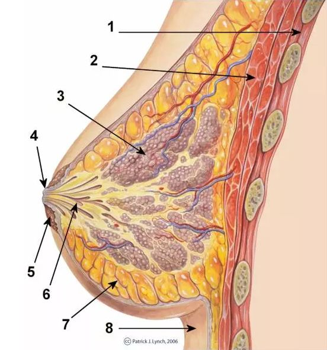
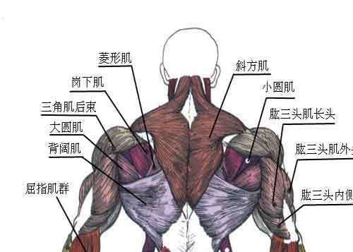

> 为了给心肝大宝贝一个完整的健身计划，今天就好好的整理一下哎各个肌肉群的训练方法和注意事项吧。

*部分动作可以参考Keep App进行学习。

下载链接：

IOS：[点我点我](https://apps.apple.com/cn/app/id952694580)

## 肌肉群与训练方法
我们主要讨论两种肌群，一个是大肌肉群，一个是小肌肉群。大肌肉群分为胸背腿三个部分，小肌肉群主要有小臂，肱二头肱三头，肩部，核心肌肉群。以下是针对各个肌肉群的不同训练方式。

### 大肌肉群
以复合方式为主，孤立动作为辅助。考虑到心肝大宝贝本身因素，先以提高运动能力为主。  
1. 胸  
  
   女性胸部图解如图所示
   
2. 
   其中可以看出来1,2为肌肉部分，其余更多的是脂肪部分，而且肌肉主要分布在内侧，脂肪分布在外侧，所以胸部训练对于女性来说，丰胸意义不大。但是这并不意味着胸肌的训练毫无效果，另外一个令女性烦恼的地方便是胸下垂的问题，而有效的锻炼，能够防止这一问题的。根据心肝大宝贝的训练要求，暂时推荐这两种徒手训练方法。  

   【[跪姿俯卧撑](https://www.bilibili.com/video/av50950808?from=search&seid=5868794219356774378)】要点：
   * 手臂与肩同宽或稍宽与肩距；
   * 收紧核心与臀部；
   * 感受胸部发力，如果感受不到，可以采取静止动作，即俯身下去到一半，停止不动，感受肌肉发力。

   【[俯卧撑](https://www.bilibili.com/video/av64630462?from=search&seid=14151057808486211556)】要点：
   * 手臂与肩同宽或稍宽与肩距；
   * 收紧核心与臀部；
   * 感受胸部发力，如果感受不到，可以采取静止动作，即俯身下去到一半，停止不动，感受肌肉发力；
   * 快上慢下，充分利用离心收缩来刺激胸肌和肱三头肌。

3. 背

   背部肌肉群如图所示

   
   对于女性，肩袖肌群、斜方肌的中下部、深层的菱形肌为主要训练目标。而宝宝的训练以徒手为主，训练目的也不是肌肥大，所以不会有过多针对性训练。

   【[Y伸展](https://show.gotokeep.com/exercises/595f4ef2ff247f33e297eb71?gender=f)，[W伸展](https://www.gotokeep.com/exercises/55cc42fb3e16ff9c32c51fab?gender=f)，[T伸展](https://www.gotokeep.com/exercises/595f4ef3ff247f33e297eb72?gender=f)】要点：
   * 可以俯身也可以直立。  
   * 感受背部肌肉发力，用背部肌肉引导动作。
   * 在做Y字伸展时尽量避免上斜方肌参与动作，如果暂时无法控制可以不做此动作

   【[俯卧挺身](https://www.gotokeep.com/exercises/564b0b02a9f7e955480ff00d?gender=f)】要点： 

   * 想象用自己的肘部触碰下背部

4. 腿 & 臀  
   【[深蹲](https://keep.com/exercises/564b0b02a9f7e955480feff2?gender=f)】要点：
   * 膝盖与脚尖位置相同
   * 站姿臀部收紧，在调整后即为最佳双脚间距
   * 下背部挺直，在整个动作过程中不可弯曲
   * 臀部向后坐，下落时感受臀部拉伸和股四头肌（大腿后侧）拉伸，起身时感受臀部收缩。

   【[箭步蹲](https://www.gotokeep.com/exercises/5976b4a7ff247f5ef05694ef?gender=f)】要点：
   * 3个90°，两个大腿与小腿之间的夹角90°，两个大腿之间也是90°。
   * 背部挺直，收紧核心。
   * 起身时感受臀部发力。
   * ***如果膝盖不适可以试试后撤步箭步蹲，如果依旧不适立刻停止训练！！！***

   【[臀桥](https://keep.com/exercises/55cc42cd5f9bd587372f64c9?gender=f)】要点：
   * 发力将臀部抬起至大腿与身体呈一条直线，此时上背部支撑地面
   * 下落时下背部贴地，但臀部悬空

### 小肌肉群
1. 核心   
   【[卷腹](https://keep.com/exercises/55cc42efb312f5f484e89acd?gender=f)】要点：
   * 感受腹部发力
   * 下背部紧贴地面，***如果有弓起现象且无法自我改正，停止训练***
   * 不可抱枕，双手应该轻放与双耳旁边，或双手交叉放于胸前

   【[卷腹摸膝](https://www.gotokeep.com/exercises/5baf4bb6a29e3409297b91b4)】要点：
   * 感受腹部发力
   * 下背部紧贴地面，***如果有弓起现象且无法自我改正，停止训练***
   * 依靠腹部发力来让手指摸到膝盖，而不是手指去够膝盖，即腹部引导，而非手臂引导。

   【[90°卷腹](https://keep.com/exercises/55d19ed28802023d535d508e?gender=f)】要点：
   * 下背部紧贴地面，***如果有弓起现象且无法自我改正，停止训练***

   【90°提臀】要点：问你家宝宝
   【站姿肘部摸膝】要点：问你家宝宝   
   【站姿抗阻转体】需要弹力带/但离身
2. 大臂（肱二头肌 & 肱三头肌）  
   【[哑铃弯举](https://gotokeep.com/exercises/54af5ef35c5f72d2058c5d11?gender=f)】要点：
   * 有手心向上和手心向内两种，暂无特殊要求，可任选其一
   * 感受肱二头肌发力，不应依靠惯性甩上去。

   肱三头肌以俯卧撑为主，此处暂时不推荐其他动作。

3. 肩部  
   【[前平举](https://keep.com/exercises/54af5ef25c5f72d2058c5b85?gender=f)，[小哑铃前平举](https://www.gotokeep.com/exercises/595f4dddff247f33e297ea8e?gender=f)】要点：
   * 有手心朝下和手心朝内两种选择，目前可任意选择，手心朝下动作更能够感受肌肉发力。

   【[侧平举](https://keep.com/exercises/586cfd9a124816784056bf6b?gender=f)，[小哑铃侧平举](https://keep.com/exercises/586cfd9a124816784056bf6b?gender=f)】要点：
   * 手肘锁死
   * 手臂不可完全伸直，手肘呈自然弧度。
   * 不能依靠惯性甩上去
   * 快上慢下
   【[反向飞鸟](https://www.gotokeep.com/exercises/55cc42e8e062b0f13e4930ee?gender=f)】要点：
   * 感受肩后束的发力（十分困难，很容易变成斜方肌发力。。。）

   【[肩推](https://www.bilibili.com/video/av30819334?from=search&seid=3678163230076382065)】要点：
   
   * 目前先无负重推举

## 为什么要健身

## 怎么健身

### 准备活动

### 训练过程

### 训练后的拉伸
1. 臀部  
   - [仰卧右侧臀部拉伸](https://keep.com/exercises/58a2e4e97dff87007c4884d9?gender=f)
   - [仰卧左侧臀部拉伸](https://gotokeep.com/exercises/58a2e4df7dff87007c4884b6?gender=f)
   - [跨坐右侧臀部拉伸](https://www.gotokeep.com/exercises/56038745331e338262f3d27b?gender=f)
   - [左侧跨坐臀部拉伸](https://keep.com/exercises/56038745331e338262f3d2a6?gender=f)
2. 大腿
   - [扶墙左腿前侧拉伸](http://keep.com/exercises/5b99e1cbd734a23309bcb815?gender=f)
   - [扶椅右大腿前侧拉伸](https://keep.com/exercises/55cc42d2683b6cd53e79e2c3?gender=f)
   - [俯身大腿后侧交替拉伸](https://www.gotokeep.com/exercises/595f4d77ff247f33e297ea6a?gender=f)
   - [俯身大腿后侧动态拉伸](https://show.gotokeep.com/exercises/58a2e4e37dff87007c4884c0?gender=f)
3. 肩部
   - [右肩后侧拉伸](https://www.gotokeep.com/exercises/586cfd95124816784056bf5a)
   - [肩前侧拉伸](https://www.gotokeep.com/exercises/55cc42d06fe674f940370652?gender=f)
4. 手臂
   - [右侧肱二头肌拉伸](https://www.gotokeep.com/exercises/5979cae611fc50467bd124eb?gender=f)
   - [右臂后侧拉伸](https://keep.com/exercises/55cc42e90f11ec78824999ea?gender=f)
5. 背部(感觉这个宝宝应该知道怎么做，毕竟瑜伽动作很多背部拉伸)
   - [跪姿背部拉伸](https://keep.com/exercises/55cc42cf6d2493fc7cd7b256?gender=f)
   - [下背部动态拉伸](https://www.gotokeep.com/exercises/55cc42fb629a97ba3b330522?gender=f)